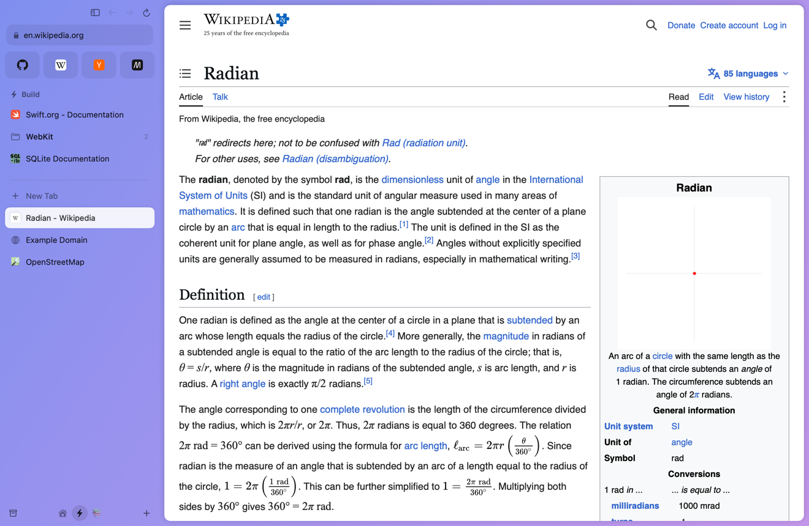
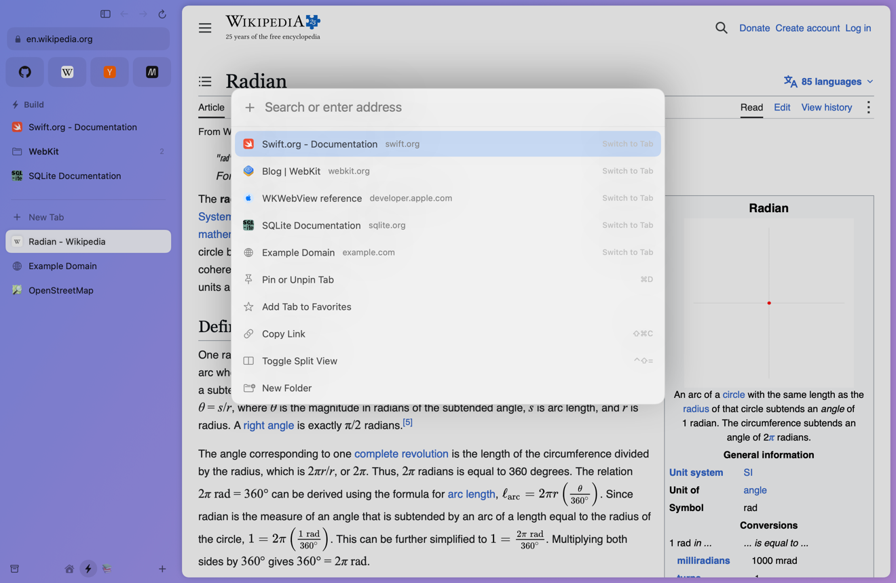
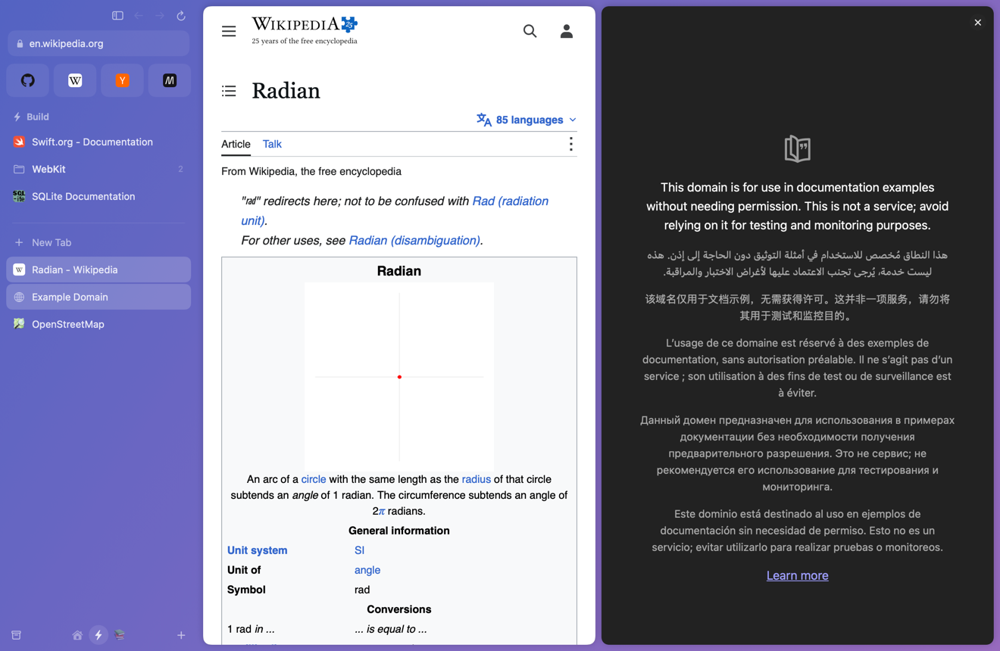

# Radian

arc is one of the most beautiful pieces of software i use. open source to keep it alive.

Radian is an open-source macOS browser built around the ideas that make Arc special: a sidebar
instead of a tab strip, spaces with their own colors, pinned tabs that remember where they belong,
a command bar for everything, and unpinned tabs that tidy themselves away. It can bring your spaces
over from Arc.



> **This is not Arc's source code.** Arc is closed-source software owned by The Browser Company,
> and its code cannot legally be published by anyone else. Radian is an independent program written
> from scratch. The only reverse engineering involved is of the file Arc stores your sidebar in,
> done so your data can leave with you. That format is written up in
> [`docs/arc-sidebar-format.md`](docs/arc-sidebar-format.md). Radian is not affiliated with or
> endorsed by The Browser Company.

## Features

- **Spaces.** Each space has a name, an icon or emoji, and a gradient theme that tints the whole
  window. Switch with `⌃1`…`⌃9`, `⌥⌘←`/`⌥⌘→`, the icons at the bottom of the sidebar, or a
  two-finger swipe over the sidebar.
- **Profiles.** Spaces on different profiles have separate cookies, logins and storage. Spaces on
  the same profile share them, along with the favorites grid.
- **Favorites.** A grid of site icons at the top of the sidebar, shared by every space on a profile.
- **Pinned tabs and folders.** A pinned tab keeps its home address. Closing it unloads it rather
  than removing it, and you can send it back home or make the current page its new home. Folders
  nest.
- **Tabs that tidy themselves.** Unpinned tabs you have not looked at in 12 hours move to the
  archive. The interval is adjustable, archiving can be turned off, and `⇧⌘T` or the archive brings
  any tab back.
- **Command bar.** `⌘T` opens something new and `⌘L` goes somewhere else in the current tab. It
  tells addresses from searches (`localhost:3000`, `192.168.1.1`, `main.swift`), completes sites you
  visit often, switches to open tabs, and runs commands.
- **Split view.** Two tabs side by side (`⌃⇧=`, or "Open in Split View" on any tab).
- **Drag and drop** between favorites, pinned, folders, tabs and spaces. Rename anything.
- The rest of a browser: find in page, zoom, downloads, permission prompts, web inspector, and it
  can be set as the default browser.

| | |
| --- | --- |
|  |  |

## Install

Radian needs macOS 14 or later and Xcode 16 or later (or a Swift 6 toolchain).

```sh
git clone https://github.com/viraatdas/arc-os.git
cd arc-os
scripts/bundle.sh          # builds build/Radian.app
open build/Radian.app
```

The build is signed ad hoc, which is enough to run it on the Mac that built it. There are no
notarized downloads yet.

To make Radian your default browser, choose it under System Settings › Desktop & Dock › Default web
browser.

## Moving from Arc

On first launch Radian offers to import from Arc. You can also do it any time with Radian ›
Import from Arc.

| Comes over | Does not |
| --- | --- |
| Spaces, with names, icons and colors | Logins, cookies and saved passwords |
| Pinned tabs and folders | History |
| Unpinned tabs | Extensions |
| Favorites | Boosts, Easels, Notes and Little Arc |
| Custom tab names | Arc account and sync |
| Profiles, as separate Radian profiles | |

Arc runs on Chromium and Radian runs on WebKit, the engine behind Safari. Their login storage is
incompatible, so expect to sign in to sites again. Radian reads Arc's files and never writes to
them. Importing twice is safe: spaces brought over before are left alone.

## Keyboard shortcuts

| Action | Shortcut |
| --- | --- |
| New tab (command bar) | `⌘T` |
| Go somewhere else in this tab | `⌘L` |
| Close tab | `⌘W` |
| Reopen closed tab | `⇧⌘T` |
| Next / previous tab | `⌥⌘↓` / `⌥⌘↑`, or `⌃⇥` / `⌃⇧⇥` |
| Tab 1–9 | `⌘1`…`⌘9` |
| Space 1–9 | `⌃1`…`⌃9` |
| Next / previous space | `⌥⌘→` / `⌥⌘←` |
| Pin or unpin tab | `⌘D` |
| Add to favorites | `⇧⌘D` |
| Copy link | `⇧⌘C` |
| Toggle sidebar | `⌘S` |
| Split view | `⌃⇧=` |
| Find in page | `⌘F` |
| Archive | `⇧⌘A` |
| New folder / new space | `⌥⌘N` / `⌃⌘N` |
| Back / forward / reload | `⌘[` / `⌘]` / `⌘R` |

## How it is built

```
Sources/
├── RadianCore/        the model, with no UI code, covered by unit tests
│   ├── Models.swift          spaces, profiles, tabs, folders, themes, settings
│   ├── BrowserState.swift    moving items, archiving, keeping state consistent
│   ├── URLResolver.swift     deciding whether command bar text is an address or a search
│   ├── FuzzyMatch.swift      ranking command bar results
│   ├── BrowsingHistory.swift visited pages, for suggestions
│   ├── ArcImporter.swift     reading Arc's sidebar file
│   └── Persistence.swift     JSON files on disk
└── Radian/            the app: AppKit and SwiftUI around WKWebView
    ├── BrowserStore.swift    state plus the live web views; every UI action goes through it
    ├── TabSession.swift      one web view and its delegates
    ├── CommandBar.swift
    └── Views/
```

State is kept in `~/Library/Application Support/Radian/`. Setting `RADIAN_DATA_DIR` points it
somewhere else, which keeps development runs away from your real data:

```sh
swift test                                            # unit tests
RADIAN_DATA_DIR=/tmp/radian-dev swift run Radian      # run against scratch data
```

Radian can also render its window to an image without showing anything on screen. This is how the
screenshots above were made, from a sample sidebar of public sites:

```sh
RADIAN_DATA_DIR=/tmp/radian-shot .build/debug/Radian --snapshot out.png \
  --import-arc path/to/StorableSidebar.json --select 7 --command-bar
```

Run `.build/debug/Radian --snapshot` with no other arguments to see every option in
`Sources/Radian/Snapshot.swift`.

## Not there yet

Radian is young. Compared with Arc it has no sync between Macs, no Chrome extensions (WebKit
cannot run them), no Little Arc windows, no peek previews, no Boosts, no AI
features, and one window per app. Contributions are welcome. Please keep
`RadianCore` free of UI code and add tests alongside changes to it.

## License

MIT. See [LICENSE](LICENSE). "Arc" and "The Browser Company" are trademarks of their owner.
